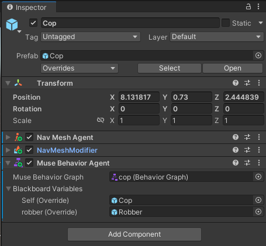

# Behavior Trees

**Comentaris previs**:

El disseny d'arbres de comportament és una tasca no trivial. Us recomano que mireu l'article Behavior trees for AI: How they work](https://www.gamedeveloper.com/programming/behavior-trees-for-ai-how-they-work).

Exiteixen dos mòduls anomenats *Muse* en Unity:

- *Muse Behavior*: mòdul per treballar amb *behavior trees*. Necessita instal·lació externa. Nosaltres treballarem amb aquest mòdul.

- *Muse AI*: mòdul de pagament que té un component *behavior* que permet generar els *behavior trees* amb tècniques d'IA generativa.

**Instal·lació en el projecte del Muse Behavior**:

Per poder utilitzar aquest component s'ha d'instal·lar previament. Aneu al menú, *Window - Package Manager*, cliqueu al **+** ubicat a la part de dalt a l'esquerra i *Add package by name..*. Introduiu el nom **com.unity.muse.behavior**. Un cop instal·lat, podeu tancar el *Package Manager*.

**Exemple**:

En aquest document mostrarem com funcionen els *behavior trees* en Unity a partir d'un exemple: un policia anirà (*seek*) cap a un lladre quan estigui lluny d'ell i l'anirà "mirant/vigilant" quan estigui a prop.

Utilitzarem el *Muse Behavior Agent* com a component per executar els *behavior trees*:

||
|:--:| 
| Component *Muse Behavior Agent* |

Tenim la *Blackboard* com a mecanisme de compartició de variables entre el *behavior trees* i l'entorn.

A continuació teniu l'implementació dels *behavior trees*:

||
|:--:| 
| Behavior Tree |

## Implementació

- [Behavior Trees](demos/bts.unitypackage)

## Referències

- [Muse Behavior](https://docs.unity3d.com/Packages/com.unity.muse.behavior@0.10/manual/index.html)

- Chris Simpson. [Behavior trees for AI: How they work](https://www.gamedeveloper.com/programming/behavior-trees-for-ai-how-they-work). Game Developer, 2014.

- Video

- [Muse AI](https://unity.com/products/muse)

- Asset [Easy Primitive People](https://assetstore.unity.com/packages/3d/characters/easy-primitive-people-161846)

- Asset [Five Seamless Tileable Ground Textures](https://assetstore.unity.com/packages/2d/textures-materials/floors/five-seamless-tileable-ground-textures-57060)

- Asset [LowPoly Trees and Rocks](https://assetstore.unity.com/packages/3d/vegetation/lowpoly-trees-and-rocks-88376)

