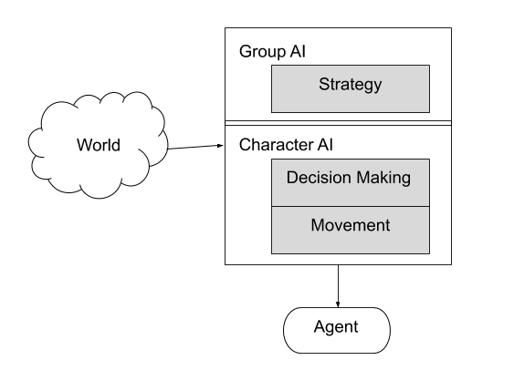
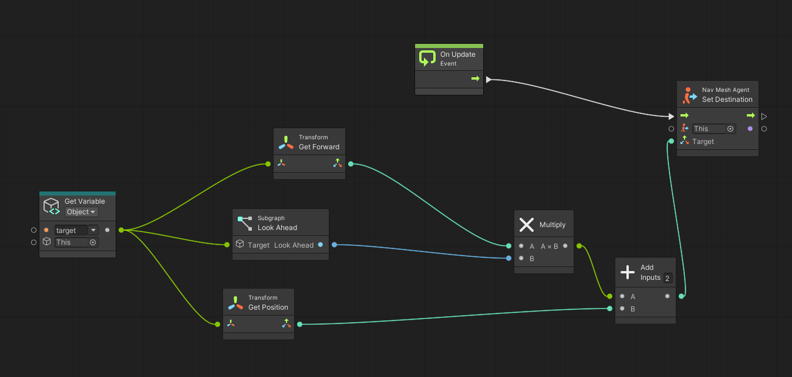
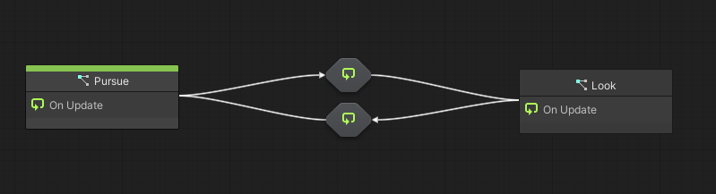
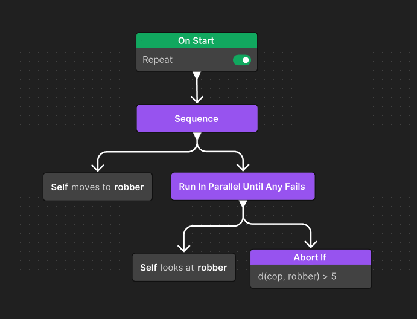
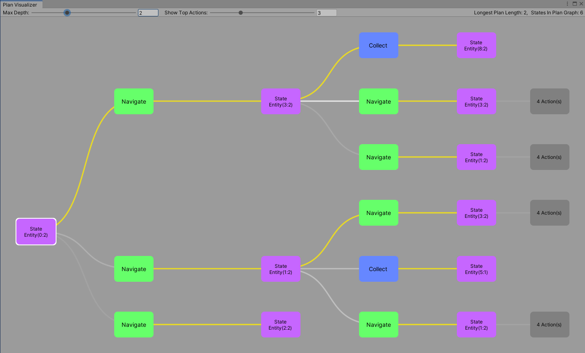

# Decision Making

La figura següent mostra els components usuals d'un sistema *Game AI*:

||
|:--:| 
| *Font: (Millington, 2019)* |

El presa de decisions (*decision making*) és el segon nivell dins d'una IA. 

El problema consisteix en decidir quina és l'acció següent que ha d'emprendre un agent (NPC) donat l'entorn.

En un nivell superior d'una IA parlaríem de les accions d'un grup d'agents. En aquest cas s'apliquen les mateixes tècniques i parlem de tàctica o estrategia.

## Mètode de programació

En els motors de videojocs trobem dues formes de programació:

- Llenguatge de programació tradicional: C# en Unity i C++ en Unreal.

- *[Visual Scripting](vs.md)*: (*blueprints* en Unreal): programació visual a base de grafs.

||
|:--:| 
| Visual Scripting Graph |

En aquest tema aprofundirem en l'ús del *visual scripting*. Aquestes tècniques es solen utilitzar sovint en equips mixtes de programadors i disenyadors.

## Algorismes habituals per *decision making*

A continuació enumerem els algorismes més utilitzats en el presa de decisions ordenats per la complexitat dels problemes que poden resoldre.

- *[Màquines d'estat](fsm.md)* (*Finite States Machines*): és l'algorime més simple. Algorisme basat en estats i transicions entre estats.

||
|:--:| 
| Màquina d'estat |

- [Behavior Trees](bts.md): algorisme que permet abordar problemes una mica més complexes que les màquines d'estat.

||
|:--:| 
| Behavior Tree |

- AI-Planner

||
|:--:| 
| *font*: [AIPlanner documentation](https://docs.unity3d.com/Packages/com.unity.ai.planner@0.3/manual/PlanVisualizer.html) |

- Llenguatges funcionals

| ```clojure
(defn fibonacci [n]
  (if (< n 2) n (+ (fibonacci (- n 1)) (fibonacci (- n 2)))))
``` |
|:--:| 
| Funció de fibonacci en clojure |

## Referències

- [Visual Scripting i màquines d'estat en Unity](https://docs.unity3d.com/Packages/com.unity.visualscripting@1.9/manual/index.html)

- Chris Simpson. [Behavior trees for AI: How they work](https://www.gamedeveloper.com/programming/behavior-trees-for-ai-how-they-work). Game Developer, 2014.

- [Muse Behavior](https://docs.unity3d.com/Packages/com.unity.muse.behavior@0.10/manual/index.html)

- [Muse AI](https://unity.com/products/muse)

- [AI Planner](https://docs.unity3d.com/Packages/com.unity.ai.planner@0.3/manual/index.html)

- [Projecte Arcadia-clojure](https://arcadia-unity.github.io/)

