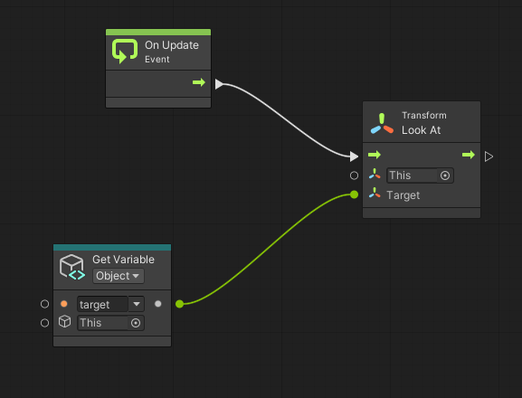
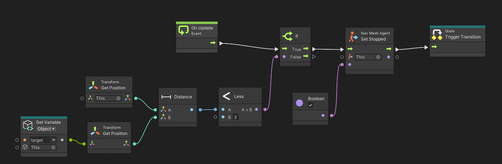
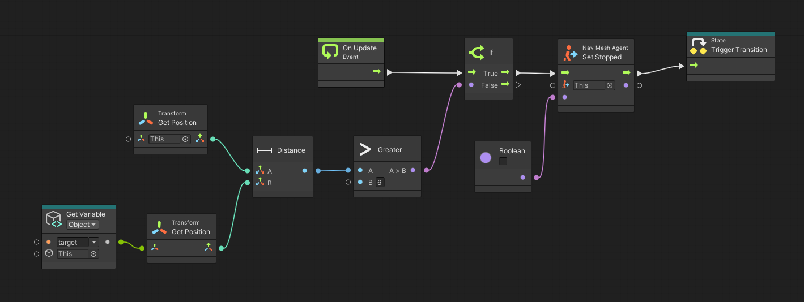

# Finite State Machines

En aquest document mostrarem com funcionen les màquines d'estats en Unity a partir d'un exemple: un policia anirà perseguint a un lladre quan estigui lluny d'ell i l'anirà "mirant/vigilant" quan estigui a prop.

Les màquines d'estats estàn integrades amb el mecanisme del *Visual Scripting*. Però utilitzarem el *State Machine* com a component per executar les màquines d'estats:

||
|:--:| 
| Component *State Machine* |

Per implementar el codi dels estats i les transicions utilitzarem graphs del *Visual Scripting*. A continuació teniu l'implementació de la màquina d'estats:

||
|:--:| 
| Màquina d'estats |

Per l'estat *pursue* utilitzarem el graph `pursue` de l'exemple de *Visual Scripting*. A continuació teniu l'implementació de l'estat *look* i les dues transicions:

||
|:--:| 
| Estat *look* |

||
|:--:| 
| Transició *pursue -> look* |

||
|:--:| 
| Transició *look -> pursue* |

## Implementació

- [Màquina d'estats](demos/fsm.unitypackage)

## Referències

- [Visual Scripting i màquines d'estats en Unity](https://docs.unity3d.com/Packages/com.unity.visualscripting@1.9/manual/index.html)

- Asset [Easy Primitive People](https://assetstore.unity.com/packages/3d/characters/easy-primitive-people-161846)

- Asset [Five Seamless Tileable Ground Textures](https://assetstore.unity.com/packages/2d/textures-materials/floors/five-seamless-tileable-ground-textures-57060)

- Asset [LowPoly Trees and Rocks](https://assetstore.unity.com/packages/3d/vegetation/lowpoly-trees-and-rocks-88376)
