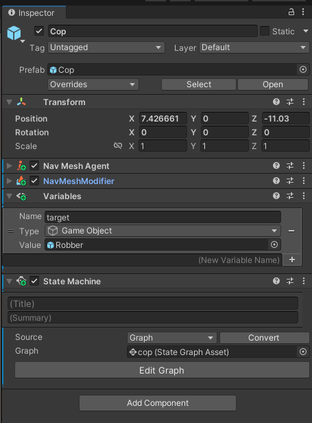

# Finite State Machines

En aquest document mostrarem com funcionen les màquines d'estat en Unity a partir d'un exemple: un policia anirà perseguint a un lladre quan estigui lluny d'ell i l'anirà "mirant/vigilant" quan estigui a prop.

Les màquines d'estat estàn integrades amb el mecanisme del *Visual Scripting*. Però utilitzarem el *State Machine* com a component per executar les màquines d'estat:

||
|:--:| 
| Component *State Machine* |

Per implementar el codi dels estats i les transicions utilitzarem graphs del *Visual Scripting*. A continuació teniu l'implementació de la màquina d'estats:

||
|:--:| 
| Màquina d'estat |

## Implementació

- [Màquina d'estats](demos/fsm.unitypackage)

## Referències

- [Visual Scripting i màquines d'estat en Unity](https://docs.unity3d.com/Packages/com.unity.visualscripting@1.9/manual/index.html)

