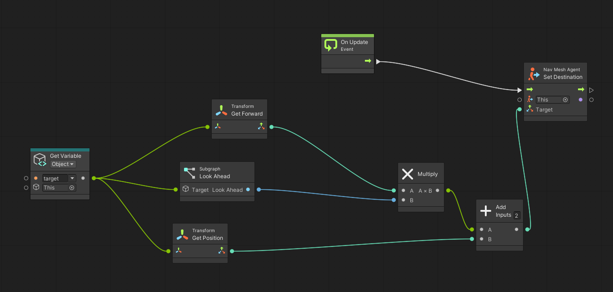

# Visual Scripting

En aquest document mostrarem com funciona el *Visual Scripting* de Unity a partir d'un exemple: l'*steering pursue*. Recordeu que teniu el codi en C# a l'apartat de moviment.

Per accedir al mòdul heu d'anar al `menú - Window - Visual Scripting - Visual Scripting Graph` o amb el botó dret crear un nou `Script Graph`. Els script graphs són els equivalents als scripts C#; contenen la lògica dels agents.

El següent component important del mòdul és el component *Script Machine* que heu d'afegir a un agent per tal de poder executar un graph.

||
|:--:| 
| Component *Script Machine* |

Un cop activeu alguna de les opcions de dalt, veureu que apareixen certs components a la `Hierarchy` (*VisualScripting SceneVariables*) i l'`Inspector` (*Variables*) de l'agent implicat. Corresponen a un dels mecanismes de compartició d'informació entre els graphs i la resta de l'entorn. També podeu crear *subgraphs* que tinguin paràmetres d'entrada i/o sortida.

La figura següent mostra el graph implementació del *pursue*:

||
|:--:| 
| pursue Graph |

Fixeu-vos que tenim accés als mètodes de la jerarquia d'objectes de Unity. Cal destacar:
- *Get Variable*: en aquest cas estem accedir al objecte target.
- *lookAhead*: correspon a la crida a un altre graph que té com a entrada l'objecte target i com a sortida el *Vector3* del *look ahead*.
- *OnUpdate*: és l'esdeveniment *OnUpdate* equivalent de C#.

A continuació es mostra el graph *lookAhead*:

||
|:--:| 
| lookAhead Graph |

## Implementació

- [Pursue en Visual Scripting](demos/vs.unitypackage)

## Referències

- [Visual Scripting i màquines d'estat en Unity](https://docs.unity3d.com/Packages/com.unity.visualscripting@1.9/manual/index.html)

- Craig W. Reynolds. [Steering Behaviors For autonomous Characters](http://www.red3d.com/cwr/papers/1999/gdc99steer.pdf). Proceedings of the Game Developers Conference (GDC), 1999.

- Asset [Easy Primitive People](https://assetstore.unity.com/packages/3d/characters/easy-primitive-people-161846)

- Asset [Five Seamless Tileable Ground Textures](https://assetstore.unity.com/packages/2d/textures-materials/floors/five-seamless-tileable-ground-textures-57060)

- Asset [LowPoly Trees and Rocks](https://assetstore.unity.com/packages/3d/vegetation/lowpoly-trees-and-rocks-88376)
