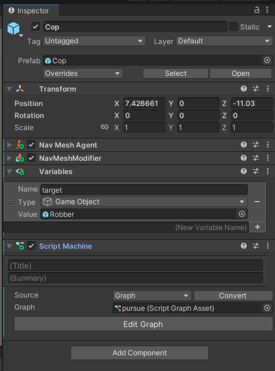
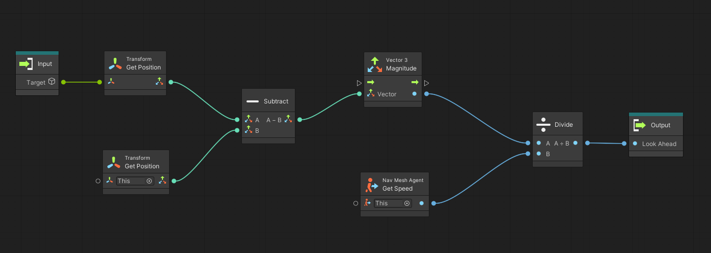

# Visual Scripting

En este documento mostraremos como funciona el *Visual Scripting* de Unity a partir de un ejemplo: el *steering pursue*. Recordad que tenéis el código en C# en el apartado de movimiento.

Para acceder al módulo tenéis que ir al `menú - Window - Visual Scripting - Visual Scripting Graph` o con el botón derecho crear un nuevo `Script Graph`. Los script graphs son los equivalentes a los scripts C#; contienen la lógica de los agentes.

El siguiente componente importante del módulo es el componente *Script Machine* que tenéis que añadir a un agente para poder ejecutar un graph.

||
|:--:| 
| Componente *Script Machine* |

Una vez activéis alguna de las opcioones de arriba, veréis que aparecen ciertos componentes en la `Hierarchy` (*VisualScripting SceneVariables*) y en el `Inspector` (*Variables*) del agente implicado. Corresponden a uno de los mecanismos de compartición de información entre los graphs y el resto del entorno. También podéis crear *subgraphs* que tengan parámetros de entrada y/o salida.

La figura siguiente muestra el graph implementación del *pursue*:

||
|:--:| 
| pursue Graph |

Fijaros que tenemos acceso a los métodos de la jerarquia de objetos de Unity. A destacar:
- *Get Variable*: en este caso estamos accediendo al objeto *target*.
- *lookAhead*: corresponde a la llamada a otro graph que tiene como entrada el objeto *target* y como salida el *Vector3* del *look ahead*.
- *OnUpdate*: es el evento *OnUpdate* equivalente de C#.

A continuación se muestra el graph *lookAhead*:

||
|:--:| 
| lookAhead Graph |

## Implementación

- [Pursue en Visual Scripting](demos/vs.unitypackage)

## Referencias

- [Visual Scripting y máquinas de estado en Unity](https://docs.unity3d.com/Packages/com.unity.visualscripting@1.9/manual/index.html)

- Craig W. Reynolds. [Steering Behaviors For autonomous Characters](http://www.red3d.com/cwr/papers/1999/gdc99steer.pdf). Proceedings of the Game Developers Conference (GDC), 1999.

- Asset [Easy Primitive People](https://assetstore.unity.com/packages/3d/characters/easy-primitive-people-161846)

- Asset [Five Seamless Tileable Ground Textures](https://assetstore.unity.com/packages/2d/textures-materials/floors/five-seamless-tileable-ground-textures-57060)

- Asset [LowPoly Trees and Rocks](https://assetstore.unity.com/packages/3d/vegetation/lowpoly-trees-and-rocks-88376)
