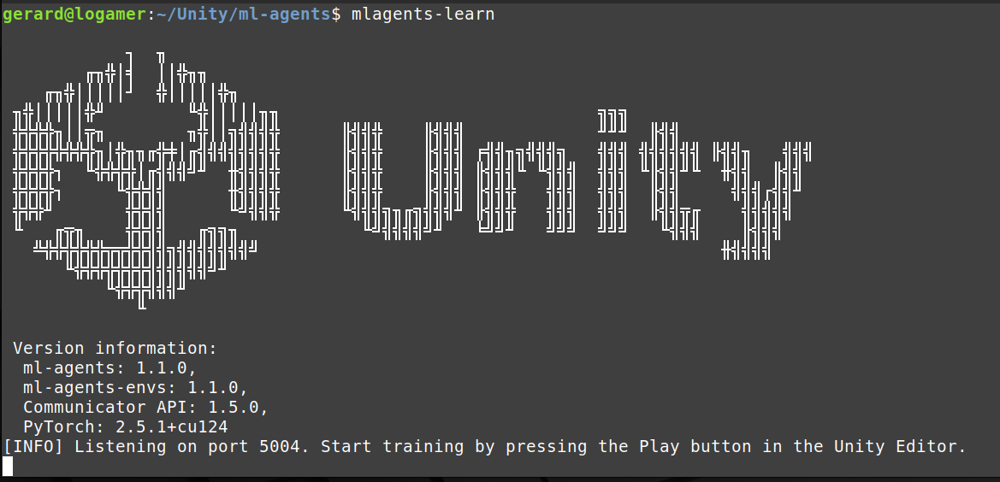
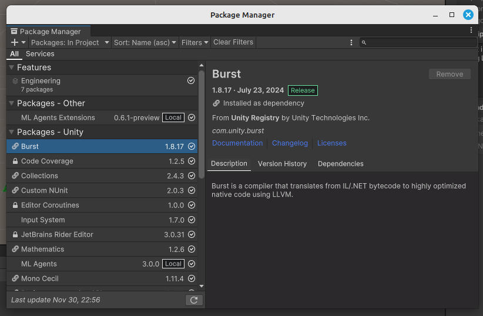
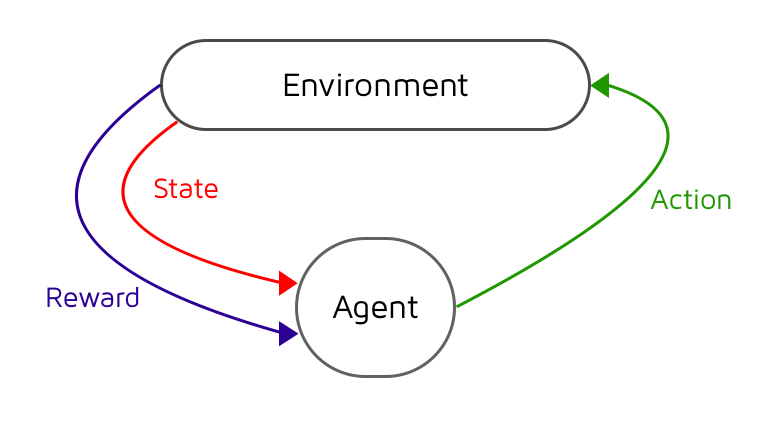

# Aprenentatge per reforç amb ML-Agents

En aquest apartat veurem com entrenar agents amb aprenentatge per reforç amb [ML-Agents](https://github.com/Unity-Technologies/ml-agents).

## Guia d'instal·lació

Per instal·lar el ML-Agents hem de seguir una sèrie de pasos que estan descrits a la [documentació oficial](https://github.com/Unity-Technologies/ml-agents/blob/develop/docs/Installation.md) del paquet.

Les probes les hem realitzat amb una màquina Linux.

**Requeriments**:

- Unity versió 2023.2 o superior.

- Python entre 3.10.1 i 2.10.12.

**Instal·lació en una màquina**:

El primer pas es obrir un terminal i instal·lar la llibreria **pytorch** (xarxes neuronals):

```
pip install torch
```

A continuació hem de clonar el component de *github*:

```
git clone --branch release_22 https://github.com/Unity-Technologies/ml-agents.git
```

A continuació instal·lem els dos paquets que connecten el *Python* amb el *ML-Agents* i *Unity*:

```
cd ml-agents/
python3 -m pip install ./ml-agents-envs
python3 -m pip install ./ml-agents
```

En aquest punt us hauria de funcionar el següent:

```
mlagents-learn
```




**Instal·lació en el projecte Unity**:

Per a cada projecte Unity que utilitzi el ML-Agents heu d'afegir un parell d'assets del component que heu clonat de *github*. Heu de mostrar el *package manager* mitjançant el menú, opció *Window* subopció *Package Manager*:



Cliqueu en el botó *+* que hi ha a la part de dalt a l'esquerra i *Add package from disk...*. En aquest punt haureu de seleccionar l'arxiu *package.json* que trobareu a la carpeta *com.unity.ml-agents*.

Repetiu el procés amb la carpeta *com.unity.ml-agents.extensions*. 

En aquest punt us haurien de sortir els paquets *ML Agents* i *ML Agents Extensions* tal i com mostra la figura de dalt.

**Nota**: per instal·lar-lo en una màquina Windows recomanen utilitzar l'Anaconda. A l'arxiu [mlagentsGuide.txt](mlagentsGuide.txt) teniu una petita que heu d'adaptar amb el que hi ha més amunt.


## Introducció

El ML-Agents té com a component principal l'aprenentatge per reforç (*Reinforcement Learning*):


[font: thomassimonini.medium](https://thomassimonini.medium.com/q-learning-lets-create-an-autonomous-taxi-part-2-2-8cbafa19d7f5)

L'aprenentatge per reforç conté dos grans elements: l'*agent* per al que volem fer aprendre un comportament i l'*entorn* en el que es mou. El procés consisteix en un bucle en el que l'entorn dona una descripció del món a l'agent (*observacions*), l'agent decideix una acció a efectuar (*actuadors*) i l'entorn li torna una *recompensa* (que pot ser negativa) en funció de com ho hagi fet l'agent.

A continuació veurem com declarar aquests components en un projecte Unity per aprendre el comportament d'un agent. Tot es fa mitjançant un *script* amb una classe de tipus *Agent* que conté tota la lògica de l'agent i un arxiu de configuració *.yml* que conté els paràmetres de l'aprenentatge.

En afegir l'script amb la classe *Agent*, ens apareixerà automàticament el component *Behavior Parameters* on podrem establir paràmetres com el tipus d'observacions o el model entrenat. Adicionalment, haurem d'afegir-li el component *Decision Requester* a l'agent.

### Observacions

Les definirem mitjantçant un mètode anomenat *CollectObservations*:

```c#
    public override void CollectObservations(VectorSensor sensor)
    {
        sensor.AddObservation(transform.position);
        sensor.AddObservation(transform.forward);
    }
```

A l'exemple estem afegint com a observacions la posició i cap a on està mirant l'agent en qüestió. Cadascun d'aquest dos tenen una mida de 3, ja que són vectors. Haurem d'especificar als *Behavior Parameters - Vecotr Observation - Space Size* una mida de 6.

Uns dels sensors més utilitzats en aquest tipus d'aprenentatge són els "Ray Casts". ML-Agents en proporciona un component per tractar-los automàticament. Només hem d'afegir el component *Ray Cast Sensor 3D* al nostre agent i configurar les seves propietats. Això inclou el *tags* dels objectes que volem detectar. En afegir aquest component, no cal afegir res al mètode *CollectObservation*. Ja ho fa ell tot sol.

### Accions

### Recompenses

### Paràmetres de l'algorisme d'entrenament

- components: recompenses, observacions, actuadors (continu vs discret), raycasting, arxiu yml

## Consells per a l'entrenament

- Heuristics

- Problemes semblants i exemples mlagents.

- Tutorial (Roller ball)
  - Demo: funcionant

- Raycasting

- Curriculum learning

- Enllaç al TFG de Haonan

- Complexitat: mida xarxa, epochs, curiosity, sac vs ??

## Referències

- [Unity ML-Agents Toolkit](https://github.com/Unity-Technologies/ml-agents)
