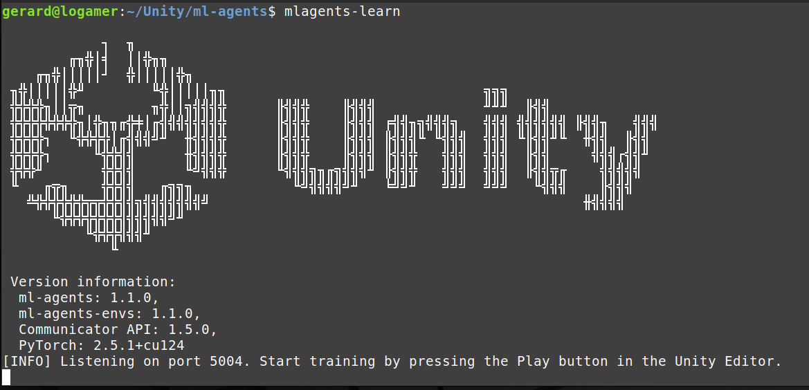

# Aprendizaje por refuerzo con ML-Agents

En este apartado veremos como entrenar agentes con aprendizaje por refuerzo con [ML-Agents](https://github.com/Unity-Technologies/ml-agents).


## Guía de instalación

Para instalar el ML-Agents tenemos que seguir una serie de pasos que estan descritos en la [documentación oficial](https://github.com/Unity-Technologies/ml-agents/blob/develop/docs/Installation.md) del paquete.

Las pruebas las hemos realizado con una máquina Linux.

**Requisitos**:

- Unity versión 2023.2 o superior.

- Python entre 3.10.1 y 2.10.12.

**Instalación en una máquina**:

El primer paso es abrir un terminal e instalar la librería **pytorch** (redes neuronales):

```
pip install torch
```

A continuación tenemos que clonar el componente de *github*:

```
git clone --branch release_22 https://github.com/Unity-Technologies/ml-agents.git
```

A continuación instalamos dos paquetes qeu conectan el *Python* con el *ML-Agents* y *Unity*:

```
cd ml-agents/
python3 -m pip install ./ml-agents-envs
python3 -m pip install ./ml-agents
```

En este punto tendría que funcionar lo que sigue:

```
mlagents-learn
```




**Instalación en el proyecto Unity**:

Para cada proyecto Unity que utilice el ML-Agetns tenéis que añadir un par de assets del componente que habéis clonado de *github*. Tenéis que mostrar el *package manager* mediante el menú, opción *Window* subopción *Package Manager*:


Clicar en el botón *+* que hay en la parte superior izquierda y *Add package from disk...*. En este punto tendréis que seleccionar el archivo *package.json* que encontraréis en la carpeta *com.unity.ml-agents*.

Repetir el proceso con la carpeta *com.unity.ml-agents.extensions*. 

En este punto os tendrían que salir los paquetes *ML Agents* y *ML Agents Extensions* tal y como muestra la figura de arriba.

**Nota**: para instalarlo en una máquina Windows recomiendan utilizar el Anaconda. En el archivo [mlagentsGuide.txt](mlagentsGuide.txt) tenéis una pequeña guía que podéis adaptar a lo que hay más arriba.


## Introducción

El ML-Agents tiene como componente principal el aprendizaje por refuerzo (*Reinforcement Learning*):


[fuente: thomassimonini.medium](https://thomassimonini.medium.com/q-learning-lets-create-an-autonomous-taxi-part-2-2-8cbafa19d7f5)

El aprendizaje por refuerzo tiene dos grandes elementos: el *agente* para el que queremos hacer aprender un comportamiento y el *entorno* en el que se mueve. El proceso consiste en un bucle en el que el entorno da una descripción del mundo al agente (*observaciones*), el agente decide una acción a efectuar (mediante *actuadores*) y el entorno le devuelve una *recompensa* (que puede ser negativa) en función de cómo lo haya hecho el agente.

A continuación veremos cómo declarar estos componentes en un proyecto Unity para aprender el comportamiento de un agente. Todo se hace mediante un *script* con una clase de tipo *Agente* que contiene toda la lógica del agente y un archivo de configuración *.yaml* que contiene los parámetros del aprendizaje.

Al añadir el script con la clase *Agente*, nos aparecerá automáticamente el componente *Behavior Parameters* donde podremos establecer parámetros como el tipo de observaciones o el modelo entrenado. Adicionalmente, deberemos añadirle el componente *Decision Requester* al agente.

### Observaciones

Las definiremos mediante un método llamado *CollectObservations*:

```c#
    public override void CollectObservations(VectorSensor sensor)
    {
        sensor.AddObservation(transform.position);
        sensor.AddObservation(transform.forward);
    }
```

En el ejemplo estamos añadiendo como observaciones la posición y hacia dónde está mirando el agente en cuestión. Cada uno de estos dos tienen un tamaño de 3, ya que son vectores. Deberemos especificar a los *Behavior Parameters - Vector Observation - Space Size* un tamaño de 6.

Unos de los sensores más utilizados en este tipo de aprendizaje son los "Ray Casts". ML-Agentes proporciona un componente para tratarlos automáticamente. Solo debemos añadir el componente *Ray Cast Sensor 3D* a nuestro agente y configurar sus propiedades. Esto incluye los *tags* de los objetos que queremos detectar. Al añadir este componente, no hay que añadir nada al método *CollectObservation*; ya lo hace él solo.

### Acciones

Hay dos tipos de acciones que podemos crear: continuas (fuerza a aplicar a un objeto) o discretas (girar a la izquierda). Si utilizamos las continuas tendremos algo como:

```c#
    public override void OnActionReceived(ActionBuffers actionBuffers)
    {
        // Actions, size = 2
        Vector3 controlSignal = Vector3.zero;
        controlSignal.x = actionBuffers.ContinuousActions[0];
        controlSignal.z = actionBuffers.ContinuousActions[1];
        rBody.AddForce(controlSignal * forceMultiplier);
    }
```
en que se está aplicando una fuerza a un objeto para controlar su movimiento. 

Si utilizamos acciones discretas:

```c#
    public override void OnActionReceived(ActionBuffers actions)
    {
        if (actions.DiscreteActions[1] == 1)
        {
            transform.Rotate(transform.up * -turnSpeed * Time.deltaTime);
        } 
        else if (actions.DiscreteActions[1] == 2)
        ...
    }
```
en que se ve el giro hacia la izquierda como una acción discreta.


### Recompensss

Para añadir recompensas tenéis dos métodos:
```c#
    AddReward(-0.01f);
    SetReward(+1f);
```

El primero añade una recompensa (se utiliza para ir añadiendo recompensas pequeñas acumulativas) y el segundo lo asigna (se utiliza en recompensas finales en caso de éxito o fracaso). 

Estas últimas suelen venir acompañadas a un llamamiento al método *EndEpisode();* que hace acabar el episodio actual. Disponemos así mismo del método *OnEpisodeBegin()* para inicializar los episodios.


### Parámetros del algoritmo de entrenamiento

Los parámetros del entrenamiento se establecen en un archivo *yaml*:

```
behaviors:
  RollerBall:                # nom de l'agent            
    trainer_type: ppo        # algorisme de reinforcement learning: ppo, sac...
    hyperparameters:
        ...
    network_settings:
      normalize: false
      hidden_units: 128      # nombre de neurones de la xarxa neuronal
      num_layers: 2          # nombre de capes de la xarxa neuronal
    reward_signals:
        ...
    max_steps: 500000        # nombre d'iteracions
    summary_freq: 10000      # freqüència de report de les recompenses
    ...
```

Los parámetros mostrados son algunos de los más importantes. Mirar la [documentación](https://unity-technologies.github.io/ml-agents/Training-Configuration-File/) para obtener más información.

## Consejos para el entrenamiento 

El diseño de sistemas de aprendizaje por refuerzo no es una tarea sencilla. Aquí os ofrecemos una serie de consejos para orientaros en esta tarea.

El primer consejo es mirar algún ejemplo parecido al que tratéis de solucionar y partir de la solución que proponen. Un recurso muy interesante es el de la [lista de ejemplos del propio ML-Agents](https://unity-technologies.github.io/ml-agents/Learning-Environment-Examples/).

El segundo consejo es que una vez programado el agente lo probéis con el método *Heuristics* que admite el control manual del agente y lo probéis a conciencia:

```c#
    public override void Heuristic(in ActionBuffers actionsOut)
    {
        ...
        var actions = actionsOut.DiscreteActions;
        actions[0] = v;
        actions[1] = h;
    }
```

La complejidad del problema a tratar requerirá una complejidad equivalente con el fin de aprender un modelo útil. Los parámetros más importantes a nivel de complejidad serán: 

- el tipo de algoritmo: *ppo*, *saco*, *curiosity*, *curriculum learning*... 

- las observaciones y recompensas del sistema 

- el número de capas y neuronas de la red neuronal 

- el número de iteraciones 

Si el sistema no es capaz de encontrar un modelo válido, revisar primero los parámetros anteriores.


## Referencias

- [Unity ML-Agents Toolkit](https://github.com/Unity-Technologies/ml-agents)

- Haonan Jin. [NPC's en Karting Game](https://upcommons.upc.edu/handle/2117/411664), 2024. [Github](https://github.com/YudaLegend/TFG-ML-AGENTS)
