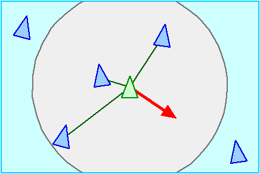

# Flocking

És el típic moviment grupal d'animals com aus o peixos.

||
|:--:| 
| *Font: [Birds of a Feather Flock](https://blogs.unimelb.edu.au/sciencecommunication/2014/09/06/birdphysics/)* |

## Components

Es basa en la suma de tres regles simples:

**Cohesion**: centre de masses dels veïns

||
|:--:|
| *Font: (Reynolds, 1999)* |

**Match velocity/align**: promig de la velocitat/direcció dels veïns

||
|:--:|
| *Font: (Reynolds, 1999)* |

**Separation**: separació dels veïns propers

||
|:--:| 
| *Font: (Reynolds, 1999)* |

## Implementació

Per aquesta implementació utilitzarem un objecte *manager* instanciarà (*spawn*) els membres del grup. Li associarem del codi següent: 

```C#
public class FlockManager : MonoBehaviour {
    public GameObject flockPrefab;
    public int numFlocks = 20;
    public float limit = 5f;
    public GameObject[] allFlocks;


    [Header("Flocking Settings")]
    [Range(0.0f, 5.0f)]
    public float minSpeed;
    [Range(0.0f, 5.0f)]
    public float maxSpeed;
    [Range(1.0f, 10.0f)]
    public float neighbourDistance;
    [Range(0.0f, 5.0f)]
    public float rotationSpeed;

    void Start() {
        allFlocks = new GameObject[numFlocks];
        for (int i = 0; i < numFlocks; ++i) {
            Vector3 pos = this.transform.position + new Vector3(Random.Range(-limit, limit),
                                                                Random.Range(-limit, limit),
                                                                Random.Range(-limit, limit));
            Vector3 randomize = new Vector3 (Random.value * 2 - 1, Random.value * 2 - 1, Random.value * 2 - 1);
            allFlocks[i] = (GameObject)Instantiate(flockPrefab, pos, Quaternion.LookRotation(randomize));
            allFlocks[i].GetComponent<Flock>().myManager = this;
        }
    }
}
```

Fixeu-vos que al mètode *Start* està instanciant els membres del grup en posicions i rotacions aleatories al voltant d'ell mateix. Així mateix està assignant-se a sí mateix a la propietat *myManager* de cadascun dels membres per tal de que puguin accedir a tots els membres i als paràmetres de l'algorisme:


Fixeu-vos que un dels paràmetres és el *preFab* (model gràfic del membre). A aquest *preFab* li haurem d'afegir el codi següent (que conté les regles del *flocking*):

```C#
public class Flock : MonoBehaviour {
    public FlockManager myManager;
    [HideInInspector]
    public float speed;
    [HideInInspector]
    public Vector3 direction;

    void Start() {
        speed = UnityEngine.Random.Range(myManager.minSpeed, myManager.maxSpeed);
        direction = transform.forward * speed;
        StartCoroutine("Flocking");
    }

    void Update() {
        transform.rotation = Quaternion.Slerp(transform.rotation,
                                              Quaternion.LookRotation(direction),
                                              myManager.rotationSpeed * Time.deltaTime);
        transform.Translate(0.0f, 0.0f, Time.deltaTime * speed);
    }

    IEnumerator Flocking()
    {
        while (true)
        {
            float waitTime = Random.Range(0.3f, 0.5f);
            yield return new WaitForSeconds (waitTime);

            FlockingRules();
        }
    }

    void FlockingRules() {
        Vector3 cohesion = Vector3.zero;
        Vector3 separation = Vector3.zero;
        Vector3 align = Vector3.zero;
        int num = 0;

        foreach (GameObject go in myManager.allFlocks) {
            if (go != this.gameObject) {
                float distance = Vector3.Distance(go.transform.position, transform.position);
                if (distance <= myManager.neighbourDistance) {
                    cohesion += go.transform.position;
                    align += go.GetComponent<Flock>().direction;
                    num++;
                    separation -= (transform.position - go.transform.position) / (distance * distance);
                }
            }
        }

        if (num > 0) {
            align /= num;
            speed = Mathf.Clamp(align.magnitude, myManager.minSpeed, myManager.maxSpeed);
            cohesion = (cohesion / num - transform.position).normalized * speed;

            direction = (cohesion + align + separation).normalized * speed;
        }
    }
}
```

### Demo

A l'arxiu [flocking](demos/flocking.unitypackage) trobareu un exemple d'implementació.

### Variants

- El *flocking* es comporta millor si li afegim molta component aleatòria. Com més li fiqueu millor.

- L'´us d'un lider és una variant del *flocking* molt utilitzada. Un exemple seria el moviment de eixams d'ocells pel cel o bancs de peixos per un aquari.

- Noteu que en el codi està utilitzant moviment cinemàtic.

## Referències

- Ian Millington. *AI for Games* (3rd ed). CRC Press, 2019.

- Asset [Fantasy Bee](https://assetstore.unity.com/packages/3d/characters/animals/fantasy-bee-135487)


