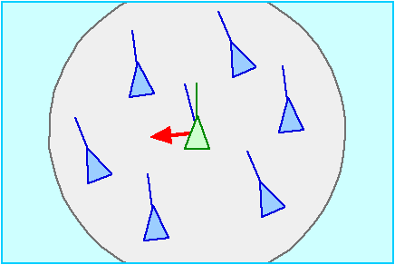

# Flocking

És el típic moviment grupal d'animals com aus o peixos.

||
|:--:| 
| *Font: [Birds of a Feather Flock](https://blogs.unimelb.edu.au/sciencecommunication/2014/09/06/birdphysics/)* |

## Components

Es basa en la suma de tres regles simples:

||||
|:--:|:--:|:--:| 
| cohesion | alignment | separation |
| *Font: (Reynolds, 1999)*          |||

**Cohesion**: centre de masses dels veïns

||
|:--:|
| *Font: (Reynolds, 1999)* |

**Match velocity/align**: promig de la velocitat/direcció dels veïns

||
|:--:|
| *Font: (Reynolds, 1999)* |

**Separation**: separació dels veïns propers

||
|:--:| 
| *Font: (Reynolds, 1999)* |

