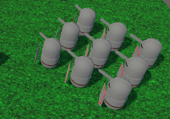

# Formation Motion

## Formació bàsica

La formació bàsica és la típica quadricula de tropes.

La implementació es basa en *slots*: un correspon al líder i per cada membre de la formació es codifica la distància al líder i la seva rotació relativa.

- $p_s=p_l+\Omega_l r_s$
- $\Omega_s=\Omega_l+\omega_s$

- $s$: slot 
- $l$: líder
- $p$: posició 
- $\Omega$: orientació
- $r$: posició respecte al líder
- $\omega$: orientació respecte al líder

### Demo

A l'arxiu [formation](demos/formation.unitypackage) trobareu un exemple d'implementació.

## Variants

- A l'exemple d'abans no hem canviat la rotació respecte al líder; en altres formacions això no és habitual

- *Formacions escalables*: hi ha formacions que depenen del nombre de membres (exemple: un cercle defensiu)

- *Formacions emergents*: hi ha formacions en cascada, no tots els membres segueixen al mateix líder (exemple: formació en fletxa)

## Referències

- Ian Millington. *AI for Games* (3rd ed). CRC Press, 2019.

- Asset [Easy Primitive People](https://assetstore.unity.com/packages/3d/characters/easy-primitive-people-161846)

- Asset [Five Seamless Tileable Ground Textures](https://assetstore.unity.com/packages/2d/textures-materials/floors/five-seamless-tileable-ground-textures-57060)

- Asset [LowPoly Trees and Rocks](https://assetstore.unity.com/packages/3d/vegetation/lowpoly-trees-and-rocks-88376)
