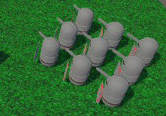

# Formation Motion

## Formación básica

La formación básica es la típica cadrícula de tropas.

La implementación se basa en *slots*: uno corresponde al líder y, para cada miembro de la formación, se codifica la distancia al líder y su rotación relativa.

- $p_s=p_l+\Omega_l r_s$
- $\Omega_s=\Omega_l+\omega_s$

- $s$: slot 
- $l$: líder
- $p$: posición 
- $\Omega$: orientación
- $r$: posición respecto al líder
- $\omega$: orientación respecto al líder

### Demo

En el archivo [formation](demos/formation.unitypackage) encontraréis un ejemplo de implementación.

## Variantes

- En el ejemplo anterior anterior no hemos cambiado la rotación respocto del líder, en otros casos será necesario hacerlo

- *Formaciones escalables*: hay formaciones que dependen del número de miembros (ejemplo: un círculo defensivo)

- *Formaciones emergentes*: hay formacions en cascada, no todos los miembros siguen al mismo líder (ejemplo: formación en flecha)

## Referencias

- Ian Millington. *AI for Games* (3rd ed). CRC Press, 2019.

- Asset [Easy Primitive People](https://assetstore.unity.com/packages/3d/characters/easy-primitive-people-161846)

- Asset [Five Seamless Tileable Ground Textures](https://assetstore.unity.com/packages/2d/textures-materials/floors/five-seamless-tileable-ground-textures-57060)

- Asset [LowPoly Trees and Rocks](https://assetstore.unity.com/packages/3d/vegetation/lowpoly-trees-and-rocks-88376)
