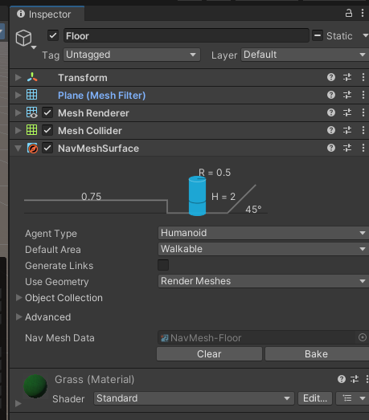

# NavMesh 

||
|:--:| 
| *Font: [Inner Workings of the Navigation System](https://docs.unity3d.com/Packages/com.unity.ai.navigation@1.1/manual/NavInnerWorkings.html)* |

## Components del sistema de navegació

**NavMesh Surface**: component per al sistema de polígons que representa tota la superfície "caminable"

**NavMesh Agent**: component per als agents que permet la navegació sobre les *NavMesh Surfaces*

**Off-Mesh Link**: component per a crear dreceres o salts entre *surfaces*

**NavMesh Obstacle**: component que permet etiquetar objectes dinàmics com a obstacles

## NavMesh Surface

**Instal·lació en el projecte**:

Per poder utilitzar aquest component s'ha d'instal·lar previament. Aneu al menú, *Window - Package Manager*, cliqueu al **+** ubicat a la part de dalt a l'esquerra i *Add package by name..*. Introduiu el nom **com.unity.ai.navigation**. Un cop instal·lat, podeu tancar el *Package Manager*.

**Creació de les superfícies**:

Seleccioneu l'objecte que representa el terra de l'escena i afegiu el component *NavMesh Surface*





```C#
using System.Collections;
using System.Collections.Generic;
using UnityEngine;
using UnityEngine.AI;

public class Moves : MonoBehaviour
{
    public NavMeshAgent agent;
    public GameObject target;

    void Start()
    {
        Seek();        
    }

    void Seek()
    {
        agent.destination = target.transform.position; 
    }
}
```

