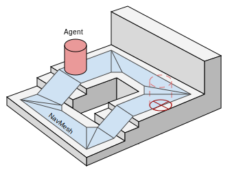
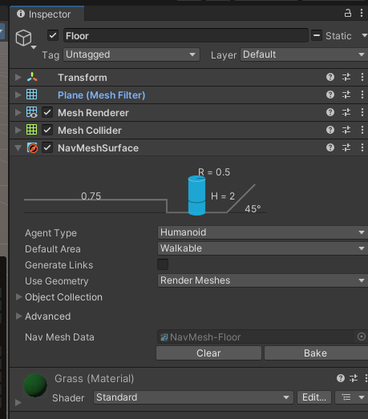
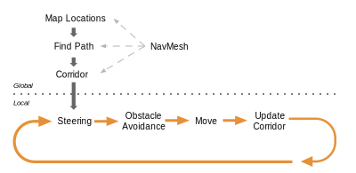
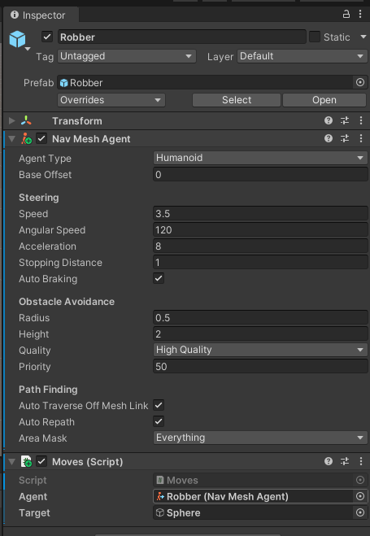
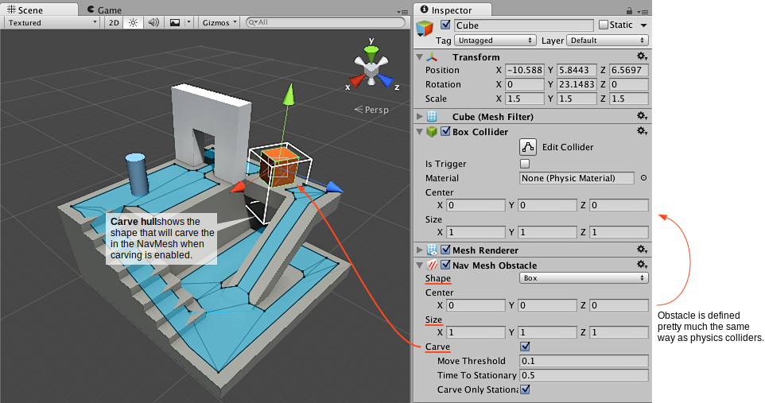

# NavMesh 

||
|:--:| 
| *Fuente: [Inner Workings of the Navigation System](https://docs.unity3d.com/Packages/com.unity.ai.navigation@1.1/manual/NavInnerWorkings.html)* |

## Componentes del sistema de navegación

**NavMesh Surface**: componente para el sistema de polígonos que representa toda la superfície "caminable"

**NavMesh Agent**: componente para los agentes que permite la navegación sobre las *NavMesh Surfaces*

**Off-Mesh Link**: componente para a crear puentes entre *surfaces*

**NavMesh Obstacle**: componente que permite etiquetar objetos dinámicos como obstáculos

## NavMesh Surface

**Instalación en el proyecto**:

Para poder utilizar este componente se tiene que instalar previamente. Ir al menú, *Window - Package Manager*, clicad en lel **+** ubicado en la parte superior izquierda y *Add package by name..*. Introducir el nombre **com.unity.ai.navigation**. Una vez instalado, podéis cerrar el *Package Manager*.

**Creación de las superfícies**:

Seleccionar el objeto que representa el suelo de la escena y añadir el componente *NavMesh Surface*. Aseguraos de que el campo *Default Area* está en *Walkable*.

Añadit el componente *NavMesh Modifier* a todos los otros objetos de la escena. Seleccionar el valor *Add or Modify object* en todos los objetos estáticos que representen obstáculos y *Remove* para los agentes.

Seleccionar el suelo y clicar en en botón *Bake* del componente *NavMesh Surface*. Esto nos creará la superfície de polígonos.



## NavMesh Agent

El *NavMesh Agent* es el responsable de hacer un *seek* combinado con el *path finding* y el *object avoidance*:

||
|:--:| 
| *Fuente: [Inner Workings of the Navigation System](https://docs.unity3d.com/Packages/com.unity.ai.navigation@1.1/manual/NavInnerWorkings.html)* |

**Componente**:

Añadir el componente *NavMesh Agent* al objeto que queramos mover.



Fijaros que podéis modificar un muchos parámetros relacionados con el movimiento.

**Script**:

Para hacer que el objeto se mueva tenéis que crear un *script* y añadirlo como componente al agente.

```C#
using System.Collections;
using System.Collections.Generic;
using UnityEngine;
using UnityEngine.AI;

public class Moves : MonoBehaviour
{
    public NavMeshAgent agent;
    public GameObject target;

    void Start()
    {
        Seek();        
    }

    void Seek()
    {
        agent.destination = target.transform.position; 
    }
}
```

Una vez hecho esto, recordar añadir, dentro del Inspector, el propio agente a la propiedad *agent* y la destinación a *target*. Asignar una posición a la propiedad *destination* del *NavMesh Agent* equivale a hacer un *seek* avanzado.

### Demo

En el archivo [seekSurface](demos/seekSurface.unitypackage) encontraréis un ejemplo de implementación. El agente involucrado se llama  *robber* i trobareu una sèrie de paràmetres.

## NavMesh Obstacles y Off-mesh Links

Dos componentes adicionales importantes relacionados con el *NavMesh*:

- **NavMesh Obstacles**: se suelen asociar a objetos dinámicos (ejemplo: puertas)

||
|:--:| 
| *Fuente: [Creating a NavMesh Obstacle](https://docs.unity3d.com/Packages/com.unity.ai.navigation@1.1/manual/CreateNavMeshObstacle.html)* |

- **Off-mesh Links**: sirven para crear puentes entre diferentes superfícies

||
|:--:| 
| *Fuente: [Creating an Off-mesh Link](https://docs.unity3d.com/Packages/com.unity.ai.navigation@1.1/manual/CreateOffMeshLink.html)* |

## Referencias

- [Inner Workings of the Navigation System](https://docs.unity3d.com/Packages/com.unity.ai.navigation@1.1/manual/NavInnerWorkings.html)

- Asset [Easy Primitive People](https://assetstore.unity.com/packages/3d/characters/easy-primitive-people-161846)

- Asset [Five Seamless Tileable Ground Textures](https://assetstore.unity.com/packages/2d/textures-materials/floors/five-seamless-tileable-ground-textures-57060)

- Asset [LowPoly Trees and Rocks](https://assetstore.unity.com/packages/3d/vegetation/lowpoly-trees-and-rocks-88376)


