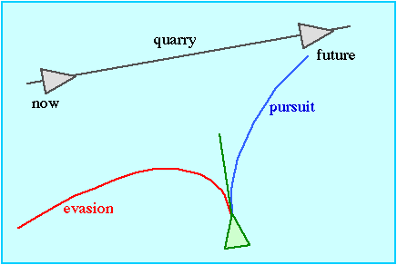

# Pursue / Evade

L'*steering* del *pursue* (perseguir) simular la persecució d'un altre agent en moviment. L'*evade* seria el moviment oposat.

||
|:--:| 
| *Font: (Reynolds, 1999)* |

La figura anterior mostra gràficament en que consisteix i el codi següent una implementació en Unity. Consisteix en estimar (*lookAhead*) cap a on anirà l'agent perseguit i fer un *seek* cap a la posició estimada.

```C#
Vector3 targetDir = target.transform.position - transform.position;
float lookAhead = targetDir.magnitude / agent.speed;
Seek(target.transform.position + target.transform.forward * lookAhead);
// Flee for evasion
```

### Demo

A l'arxiu [pursue](demos/pursue.unitypackage) trobareu un exemple d'implementació.

## Referències

- Craig W. Reynolds. [Steering Behaviors For autonomous Characters](http://www.red3d.com/cwr/papers/1999/gdc99steer.pdf). Proceedings of the Game Developers Conference (GDC), 1999.

- Asset [Easy Primitive People](https://assetstore.unity.com/packages/3d/characters/easy-primitive-people-161846)

- Asset [Five Seamless Tileable Ground Textures](https://assetstore.unity.com/packages/2d/textures-materials/floors/five-seamless-tileable-ground-textures-57060)

- Asset [LowPoly Trees and Rocks](https://assetstore.unity.com/packages/3d/vegetation/lowpoly-trees-and-rocks-88376)
