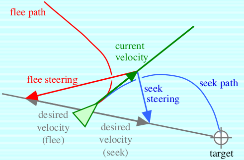
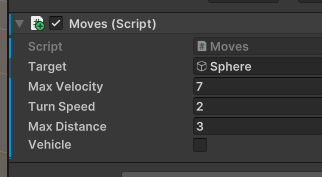
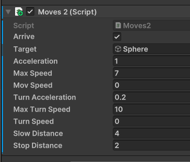

# Seek y Flee

En el movimiento *seek* calculamos la dirección del agente hacia su destino. El *flee* será su moviento contrario.



Font: (Reynolds, 1999)

## Movimiento cinemático

**Entrada**:

- Agente (posición y orientación)

- Target (posición)

- VelocidadMáxima, rotaciónMáxima 

**Salida**:

- Velocidad y ángulo 

### Proceso

**Dirección deseada**: vector posición target - posición del agente 
$$d=(t_x-r_x, 0, t_z-r_z)$$

```C#
// Seek
Vector3 direction = target.transform.position - transform.position;
direction.y = 0f;    // (x, z): position in the floor
// Flee
Vector3 direction = transform.position - target.transform.position;
```

**Velocidad**: vector dirección con magnitud *maxVelocity*
$$\vert d\vert=\sqrt{d_x^2+d_z^2};v=\frac{d}{\vert d\vert}maxVelocity$$

```C#
Vector3 movement = direction.normalized * maxVelocity;
```

**Rotación deseada**:

```C#
float angle = Mathf.Rad2Deg * Mathf.Atan2(movement.x, movement.z);
Quaternion rotation = Quaternion.AngleAxis(angle, Vector3.up);  // up = y
```

### Demo

En el archivo [seekKin.zip](demos/seekKin.zip) encontraréis un ejemplo de implementación.
El agente involucrado se llama *robber* y tiene una serie de parámetros:



El parámetro *vehicle* sireve para indicar que haga el giro y el movimiento de avanzar a la vez. En caso contrario, primero gira y después avanza.

## Movimientos de *Steering*

Los movimientos cinemáticos tienen el inconveniente de que no son muy realistas. Los movimientos de *steering* añaden aceleración a los anteriores para solucionarlo.

A continuación tenéis el código que necesitamos:

```C#
turnSpeed += turnAcceleration * Time.deltaTime;
turnSpeed = Mathf.Min(turnSpeed, maxTurnSpeed);
movSpeed += acceleration * Time.deltaTime;
movSpeed = Mathf.Min(movSpeed, maxSpeed);
```

### Arriving

Tenemos que evitar que un agente en movimiento llegue a su destino. En caso contrario, puede empezar a realizar movimientos cíclicos alrededor del destino. Dos comportamientos de parada son:

- **Stopping distance**: el agente para al llegar a una cierta distancia del objetivo

- **Steering Arrive**: el agente empieza a frenar al llegar una distància de parada

$$speed=\frac{maxSpeed\times distance}{slowRadius}$$

### Demo

En el archivo [seekSteering.zip](demos/seekSteering.zip) encontraréis un ejemplo de implementación.
El agente involucrado se llama *robber* y tiene algunos parámetros:



## Referencias

- Craig W. Reynolds. [Steering Behaviors For autonomous Characters](http://www.red3d.com/cwr/papers/1999/gdc99steer.pdf). Proceedings of the Game Developers Conference (GDC), 1999.

- Asset [Easy Primitive People](https://assetstore.unity.com/packages/3d/characters/easy-primitive-people-161846)

- Asset [Five Seamless Tileable Ground Textures](https://assetstore.unity.com/packages/2d/textures-materials/floors/five-seamless-tileable-ground-textures-57060)

- Asset [LowPoly Trees and Rocks](https://assetstore.unity.com/packages/3d/vegetation/lowpoly-trees-and-rocks-88376)

