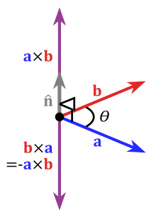

# Utilitats matemàtiques per al moviment

**Distància entre dos punts**]:

$$d(v,w)=\sqrt{(w_x-v_x)^2+(w_z-v_z)^2}$$

```C#
Vector3.Distance(target.transform.position, transform.position)
```

**Angle entre 2 vectors**:

```C#
Mathf.Abs(Vector3.Angle(transform.forward, movement)  // forward = z
```

- dot product: $\langle v,w\rangle=v_x\cdot w_x+v_y\cdot w_y$

$$\theta=\arccos{\frac{\langle v,w\rangle}{\vert v\vert \vert w\vert}}$$

**Angle amb signe**:

```C#
Vector3.SignedAngle(v, w, transform.forward)
```

- cross product: 

$$v\times w=(v_y\cdot w_z-v_z\cdot w_y,v_z\cdot w_x-v_x\cdot v_z,v_x\cdot w_y-v_y\cdot w_x)$$

- Clockwise: $(v\times w).z<0$

- Anti-clockwise: $(v\times w).z<0$

<br>
Font: [wikipedia](https://en.wikipedia.org/wiki/Cross_product)
