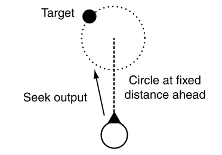

# Wander

El *steering* del *wander* quiere simular a un agente paseando tranquilamente.

||
|:--:| 
| *Fuente: (Millington, 2019)* |

La figura anterior muestra en que consiste y el código siguiente una implementación en Unity. El algoritmo tiene dos parámetros:
- **radio** de un círculo: se calcula aleatoriamente un punto de la circumferencia.
- **offset**: se le suma esta distancia al punto anterior.
El punto resultante del *wander* será la suma de este vector al *forward* del agente (eje Z). Se va llamando al *wander* cada vez que el agente se acerca al último punto y se hace un *seek* hacia el nuevo punto.

```C#
Vector3 localTarget =  UnityEngine.Random.insideUnitSphere;
localTarget.y = 0f;
localTarget.Normalize();
localTarget *= radius;
localTarget += new Vector3(0, 0, offset);

Vector3 worldTarget = transform.TransformPoint(localTarget);
worldTarget.y = 0f;

Seek(worldTarget);
```

De cara a implementar el movimiento se tienen que ajustar los parámetros para que la velocidad sigui relativamente baja y controlar que el punto resultante del *wander* esté en una posición "caminable".


### Demo

En el archivo [wander](demos/wander.unitypackage) encontraréis un ejemplo de implementación.

## Referències

- Ian Millington. *AI for Games* (3rd ed). CRC Press, 2019.

- Asset [Easy Primitive People](https://assetstore.unity.com/packages/3d/characters/easy-primitive-people-161846)

- Asset [Five Seamless Tileable Ground Textures](https://assetstore.unity.com/packages/2d/textures-materials/floors/five-seamless-tileable-ground-textures-57060)

- Asset [LowPoly Trees and Rocks](https://assetstore.unity.com/packages/3d/vegetation/lowpoly-trees-and-rocks-88376)
